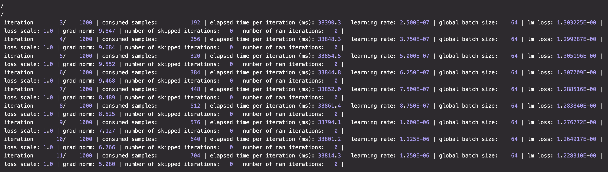

# ascend-cookbook
## Ascend for ubuntu22.,04

本文记录在910B3服务器上安装docker并构建ubuntu22.04的npu开发镜像全流程，测试预训练LLM和**ascend c**算子开发

## Docker

### 安装Docker

完全按照官网教程进行[[Install using the apt repository](https://docs.docker.com/engine/install/ubuntu/#install-using-the-repository)](https://docs.docker.com/engine/install/ubuntu/#install-using-the-repository)

1. 设置apt源和GPGkey

```shell
# Add Docker's official GPG key:
sudo apt-get update
sudo apt-get install ca-certificates curl
sudo install -m 0755 -d /etc/apt/keyrings
sudo curl -fsSL https://download.docker.com/linux/ubuntu/gpg -o /etc/apt/keyrings/docker.asc
sudo chmod a+r /etc/apt/keyrings/docker.asc

# Add the repository to Apt sources:
echo \
  "deb [arch=$(dpkg --print-architecture) signed-by=/etc/apt/keyrings/docker.asc] https://download.docker.com/linux/ubuntu \
  $(. /etc/os-release && echo "$VERSION_CODENAME") stable" | \
  sudo tee /etc/apt/sources.list.d/docker.list > /dev/null
sudo apt-get update
```

2. 下载必要软件

```shell
sudo apt-get install docker-ce docker-ce-cli containerd.io docker-buildx-plugin docker-compose-plugin
```

3. 验证安装, 看到hello world 就成功了

```shell
sudo docker run hello-world
```

### 安装Ascend Docker Runtime

ascend为docker开发的插件，用于启动容器时自动映射驱动文件和配置

1. [下载](https://gitee.com/ascend/ascend-docker-runtime/releases/)

```shell
wget https://gitee.com/ascend/ascend-docker-runtime/releases/download/v5.0.0-Patch5/Ascend-docker-runtime_5.0.0.5_linux-aarch64.run
wget https://gitee.com/ascend/ascend-docker-runtime/releases/download/v5.0.0-Patch5/Ascend-docker-runtime_5.0.0.5_linux-aarch64.run.sha256sum
```

2. 执行如下命令，校验软件包安装文件的一致性和完整性。

```shell
./Ascend-docker-runtime_5.0.0.5_linux-aarch64.run --check
```

3. 执行以下命令，为软件包添加可执行权限。

```shell
chmod u+x Ascend-docker-runtime_5.0.0.5_linux-aarch64.run
```

3. 可通过以下命令安装Ascend Docker Runtime。

- 安装到默认路径下，执行以下命令。

```
./Ascend-docker-runtime_5.0.0.5_linux-aarch64.run --install
```

- 安装到指定路径下，执行以下命令，

```
./Ascend-docker-runtime_5.0.0.5_linux-aarch64.run --install --install-path=<path>
```

4. 执行以下命令，使Ascend Docker Runtime生效。

```shell
systemctl daemon-reload && systemctl restart docker
```

## 拉取镜像设置环境

### run

1. 启动容器，映射文件和端口，使用 `ASCEND_VISIBLE_DEVICES=0,1,2,3,4,5,6,7`设置npu，注意默认情况下一个宿主机的一张npu同时只能用于一个运行中的容器使用，设置`--shm-size=512g` 务必，当训练时share memory可能会oom

```shell
docker run -itd -e ASCEND_VISIBLE_DEVICES=0,1,2,3,4,5,6,7 --shm-size=512g --name npu-ubuntu --hostname npu-ubuntu -p 29004:22 -p 29005:29005 -p 29006:29006 -v /data:/data -v /mnt:/mnt ubuntu:22.04 /bin/bash
```

2. 设置`~/.bashrc`环境变量，使得容器可以执行`npu-smi info` 命令，ps.该命令需要root权限

>正常情况下，容器中的`/usr/local/Ascend/driver/`应当会映射宿主机的驱动，本文默认宿主机环境已经配好，并安装完驱动，如果没有请找人帮忙！

```shell
# driver 地址
DRV_LIB64_COMMON_LDPATH="/usr/local/Ascend/driver/lib64/common"
DRV_LIB64_DRV_LDPATH="/usr/local/Ascend/driver/lib64/driver"
DRV_LIB64_LDPATH="/usr/local/Ascend/driver/lib64"
export LD_LIBRARY_PATH="${DRV_LIB64_COMMON_LDPATH}":"${DRV_LIB64_DRV_LDPATH}":"${DRV_LIB64_LDPATH}":"${LD_LIBRARY_PATH}"
```

3. 不出意外可以在容器内执行`npu-smi info` 命令并获得类似结果:

```

+------------------------------------------------------------------------------------------------+
| npu-smi 23.0.0                   Version: 23.0.0                                               |
+---------------------------+---------------+----------------------------------------------------+
| NPU   Name                | Health        | Power(W)    Temp(C)           Hugepages-Usage(page)|
| Chip                      | Bus-Id        | AICore(%)   Memory-Usage(MB)  HBM-Usage(MB)        |
+===========================+===============+====================================================+
| 0     910B3               | OK            | 92.2        36                0    / 0             |
| 0                         | 0000:C1:00.0  | 0           0    / 0          3314 / 65536         |
+===========================+===============+====================================================+
| 1     910B3               | OK            | 91.9        38                0    / 0             |
| 0                         | 0000:C2:00.0  | 0           0    / 0          3307 / 65536         |
+===========================+===============+====================================================+
| 2     910B3               | OK            | 93.3        37                0    / 0             |
| 0                         | 0000:81:00.0  | 0           0    / 0          3308 / 65536         |
+===========================+===============+====================================================+
| 3     910B3               | OK            | 94.7        38                0    / 0             |
| 0                         | 0000:82:00.0  | 0           0    / 0          3308 / 65536         |
+===========================+===============+====================================================+
| 4     910B3               | OK            | 94.8        41                0    / 0             |
| 0                         | 0000:01:00.0  | 0           0    / 0          3307 / 65536         |
+===========================+===============+====================================================+
| 5     910B3               | OK            | 95.8        44                0    / 0             |
| 0                         | 0000:02:00.0  | 0           0    / 0          3307 / 65536         |
+===========================+===============+====================================================+
| 6     910B3               | OK            | 92.5        41                0    / 0             |
| 0                         | 0000:41:00.0  | 0           0    / 0          3307 / 65536         |
+===========================+===============+====================================================+
| 7     910B3               | OK            | 93.3        43                0    / 0             |
| 0                         | 0000:42:00.0  | 0           0    / 0          3307 / 65536         |
+===========================+===============+====================================================+
+---------------------------+---------------+----------------------------------------------------+
| NPU     Chip              | Process id    | Process name             | Process memory(MB)      |
+===========================+===============+====================================================+
| No running processes found in NPU 0                                                            |
+===========================+===============+====================================================+
| No running processes found in NPU 1                                                            |
+===========================+===============+====================================================+
| No running processes found in NPU 2                                                            |
+===========================+===============+====================================================+
| No running processes found in NPU 3                                                            |
+===========================+===============+====================================================+
| No running processes found in NPU 4                                                            |
+===========================+===============+====================================================+
| No running processes found in NPU 5                                                            |
+===========================+===============+====================================================+
| No running processes found in NPU 6                                                            |
+===========================+===============+====================================================+
| No running processes found in NPU 7                                                            |
+===========================+===============+====================================================+
```

## 安装cann

### 下载如下文件

> 验证cann7.0.0可以训练，但是8.0.0.RC3会有问题，默认使用的torch和torch_npu 版本为 2.1.0

```shell
Ascend-cann-toolkit_7.0.0_linux-aarch64.run
Ascend-cann-nnae_7.0.0_linux-aarch64
Ascend-cann-kernels-910b_7.0.0_linux.run
```

### 依次执行安装

```shell
./Ascend-cann-toolkit_7.0.0_linux-aarch64.run --install
./Ascend-cann-nnae_7.0.0_linux-aarch64 --install
./Ascend-cann-kernels-910b_7.0.0_linux.run --install
```

设置`~/.bashrc`环境变量

```shell
# 环境配置脚本
source /usr/local/Ascend/ascend-toolkit/set_env.sh

# 算子开发
export ASCEND_TENSOR_COMPILER_INCLUDE=/usr/local/Ascend/ascend-toolkit/latest/aarch64-linux/include

# 设置path 支持
export PATH=/usr/local/Ascend/ascend-toolkit/latest/python/site-packages/bin/:$PATH

# 几个pip库需要特殊照顾
export LD_PRELOAD="/root/miniconda3/envs/llm/lib/python3.9/site-packages/scikit_learn.libs/libgomp-d22c30c5.so.1.0.0 /root/miniconda3/envs/llm/lib/libgomp.so.1"
```

## 安装Miniconda 

conda 是一种python的虚拟环境工具，用于管理不同版本的python和pip包，广泛应用于多环境多版本的场景下

1. `Miniconda`官方下载

```shell
wget https://repo.anaconda.com/miniconda/Miniconda3-latest-Linux-aarch64.sh
```

2. 赋予权限并执行安装，一路点点点，最后执行一下 /

```shell
chmod +x Miniconda3-latest-Linux-aarch64.sh
./Miniconda3-latest-Linux-aarch64.sh
```

## 安装Pytorch

1. pytorch环境安装

```shell
conda create -n llm_torch python=3.9
pip install torch==2.1.0
pip install torch_npu==2.1.0
pip install numpy pyyaml setuptools
```

## 预训练Qwen-7B-Chat

0. 下载`ascend/modellink`

```shell
git clone https://gitee.com/ascend/ModelLink.git
```

1. 安装`AscendSpeed`:

```shell
# 安装加速库
git clone https://gitee.com/ascend/AscendSpeed.git
cd AscendSpeed
pip install -r requirements.txt
pip install -e .
cd ..
```

2. 安装ascend修改的apex版本，用于混合精度训练

```shell
pip install setuptools==65.7.0 # 最好该版本,其余版本会报错

git clone https://gitee.com/ascend/apex.git
cd apex/
bash scripts/build.sh --python=3.8
# 会从github拉去apex官方版本
cd apex/dist/
pip uninstall apex
pip install --upgrade apex-0.1_ascend-cp38-cp38-linux_aarch64.whl
```

3. 权重转换，默认已经下载完成了hf版本的qwen模型和代码：https://huggingface.co/Qwen/Qwen-7B-Chat/。 
保存在`./model_from_hf/Qwen-7B-Chat/`目录下，生成符合megatron需求的模型文件，存储在`./model_weights/Qwen-7B-Chat-v0.1-tp8-pp1/`目录下

```shell
python tools/checkpoint/convert_ckpt.py \
   --model-type GPT \
   --loader qwen_hf \
   --saver megatron \
   --target-tensor-parallel-size 8 \
   --load-dir ./model_from_hf/Qwen-7B-Chat/ \
   --save-dir ./model_weights/Qwen-7B-Chat-v0.1-tp8-pp1/ \
   --tokenizer-model ./model_from_hf/Qwen-7B-Chat/qwen.tiktoken \
   --add-qkv-bias
```

4. 下载训练数据集

```shell
cd ./dataset/
wget https://hf-mirror.com/datasets/tatsu-lab/alpaca/resolve/main/data/train-00000-of-00001-a09b74b3ef9c3b56.parquet
cd ..

# 处理数据   
mkdir ./dataset/Qwen-7B-Chat/
python ./tools/preprocess_data.py \
   --input ./dataset/train-00000-of-00001-a09b74b3ef9c3b56.parquet \
   --tokenizer-name-or-path ./model_from_hf/Qwen-7B-Chat/ \
   --output-prefix ./dataset/Qwen-7B-Chat/alpaca \
   --tokenizer-type PretrainedFromHF \
   --seq-length 8192 \
   --workers 4 \
   --log-interval 1000
```

5. 配置Qwen-7B-Chat 预训练脚本: `examples/qwen/pretrain_qwen_7b_ptd.sh`

```shell
# 设置 ascend-toolkit 路径
source /usr/local/Ascend/ascend-toolkit/set_env.sh 

# 根据实际情况配置词表、数据集、模型参数保存路径
CKPT_SAVE_DIR="./ckpt/Qwen-7B-Chat/" #模型地址
TOKENIZER_MODEL="./model_from_hf/Qwen-7B-Chat/"  #词表路径
DATA_PATH="./dataset/Qwen-7B-Chat/alpaca_text_document"  #数据集路径
CKPT_LOAD_DIR="./model_weights/Qwen-7B-Chat-v0.1-tp8-pp1/"
```

6.  开始训练，结果文件将保存在`./ckpt/Qwen-7B-Chat/`

```shell
nohup bash examples/qwen/pretrain_qwen_7b_ptd.sh &
```



7. 测试推理：

​	**TODO:**


## 算子开发

我们以**sinh**算子为例，开发自定义算子
$$
sinh(x) = 0.5 * (exp(x) - exp(-x))/2
$$


1. 环境配置

cann-tools安装完成后，已经包括了算子开发的相关环境，不过需要在`~/.bashrc`中export对应的编译文件地址

ps. `set_env.sh`居然需要手动执行，直接加载bashrc里不好吗？

ps. 该部分为什么不自动添加在`set_env.sh`中？

```shell
export ASCEND_TENSOR_COMPILER_INCLUDE=/usr/local/Ascend/ascend-toolkit/latest/aarch64-linux/include
```

同时，如果使用**conda**的话，可能默认的`protobuf`库版本过新，需要降级到(**3.20.7)**，否则可能会出现一下问题:

```shell
Traceback (most recent call last):
  File "/usr/local/Ascend/ascend-toolkit/7.0.0/python/site-packages/opc_tool/opc.py", line 24, in <module>
    import ge_ir_pb2
  File "/usr/local/Ascend/ascend-toolkit/7.0.0/python/site-packages/opc_tool/ge_ir_pb2.py", line 33, in <module>
    _descriptor.EnumValueDescriptor(
  File "/root/miniconda3/envs/llm/lib/python3.9/site-packages/google/protobuf/descriptor.py", line 914, in __new__
    _message.Message._CheckCalledFromGeneratedFile()
TypeError: Descriptors cannot be created directly.
If this call came from a _pb2.py file, your generated code is out of date and must be regenerated with protoc >= 3.19.0.
If you cannot immediately regenerate your protos, some other possible workarounds are:
 1. Downgrade the protobuf package to 3.20.x or lower.
 2. Set PROTOCOL_BUFFERS_PYTHON_IMPLEMENTATION=python (but this will use pure-Python parsing and will be much slower).
```

2. 基于`msopgen` 工具，构建demo代码。详细说明可见：https://www.hiascend.com/document/detail/zh/CANNCommunityEdition/700alpha003/operatordevelopment/ascendcopdevg/atlas_ascendc_10_0027.html

**SinhCustom.json:定义算子输入，输出，格式，类型**

```json
[
    {
        "op": "SinhCustom",
        "language":"cpp",
        "input_desc": [
            {
                "name": "x",
                "param_type": "required",
                "format": [
                    "ND"
                ],
                "type": [
                    "fp16"
                ]
            }
        ],
        "output_desc": [
            {
                "name": "y",
                "param_type": "required",
                "format": [
                    "ND"
                ],
                "type": [
                    "fp16"
                ]
            }
        ]
    }
]
```

```shell
export PATH=/usr/local/Ascend/ascend-toolkit/latest/python/site-packages/bin/:$PATH

# cpp算子
msopgen gen -i SinhCustom.json -c ai_core-Ascend910B3 -lan cpp -out ./SinhCustom
```


3. 修改生成代码文件，实现算子host端和device端

- `op_host/sinh_custom.cpp` 

  ```c++
  #include "sinh_custom_tiling.h"
  #include "register/op_def_registry.h"
  
  
  namespace optiling {
  const uint32_t BLOCK_DIM = 8;
  const uint32_t TILE_NUM = 8;
  
  static ge::graphStatus TilingFunc(gert::TilingContext* context)
  {
  
    SinhCustomTilingData tiling;
    uint32_t totalLength = context->GetInputTensor(0)->GetShapeSize();
    context->SetBlockDim(BLOCK_DIM);
    tiling.set_totalLength(totalLength);
    tiling.set_tileNum(TILE_NUM);
    tiling.SaveToBuffer(context->GetRawTilingData()->GetData(), context->GetRawTilingData()->GetCapacity());
    context->GetRawTilingData()->SetDataSize(tiling.GetDataSize());
    size_t *currentWorkspace = context->GetWorkspaceSizes(1);
    currentWorkspace[0] = 0;
    return ge::GRAPH_SUCCESS;
  }
  }
  
  
  namespace ge {
  static ge::graphStatus InferShape(gert::InferShapeContext* context)
  {
      const gert::Shape* x1_shape = context->GetInputShape(0);
      gert::Shape* y_shape = context->GetOutputShape(0);
      *y_shape = *x1_shape;
      return GRAPH_SUCCESS;
  }
  }
  
  
  namespace ops {
  class SinhCustom : public OpDef {
  public:
      explicit SinhCustom(const char* name) : OpDef(name)
      {
          this->Input("x")
              .ParamType(REQUIRED)
              .DataType({ge::DT_FLOAT16})
              .Format({ge::FORMAT_ND})
              .UnknownShapeFormat({ge::FORMAT_ND});
          this->Output("y")
              .ParamType(REQUIRED)
              .DataType({ge::DT_FLOAT16})
              .Format({ge::FORMAT_ND})
              .UnknownShapeFormat({ge::FORMAT_ND});
  
          this->SetInferShape(ge::InferShape);
  
          this->AICore()
              .SetTiling(optiling::TilingFunc);
          this->AICore().AddConfig("ascend910b");
  
      }
  };
  
  OP_ADD(SinhCustom);
  }
  ```
  
- `op_host/sinh_custom_tiling.h`

  ```c++
  #ifndef SINH_CUSTOM_TILING_H
  #define SINH_CUSTOM_TILING_H
  #include "register/tilingdata_base.h"
  
  namespace optiling {
  BEGIN_TILING_DATA_DEF(SinhCustomTilingData)
    TILING_DATA_FIELD_DEF(uint32_t, totalLength);
    TILING_DATA_FIELD_DEF(uint32_t, tileNum);
  END_TILING_DATA_DEF;
  
  REGISTER_TILING_DATA_CLASS(SinhCustom, SinhCustomTilingData)
  }
  #endif // SINH_CUSTOM_TILING_H
  ```

- `op_kernel/sinh_custom.cpp`：

  关键实现**Compute**方法中关于算子的计算逻辑
  
  ```c++
  #include "kernel_operator.h"
  using namespace AscendC;
  constexpr int32_t BUFFER_NUM = 2;                                     // tensor num for each queue
  
  class KernelSinh {
  public:
      __aicore__ inline KernelSinh() {}
      __aicore__ inline void Init(GM_ADDR x, GM_ADDR y, uint32_t totalLength, uint32_t tileNum)
      {
          ASSERT(GetBlockNum() != 0 && "block dim can not be zero!");
          this->blockLength = totalLength / GetBlockNum();
          this->tileNum = tileNum;
          ASSERT(tileNum != 0 && "tile num can not be zero!");
          this->tileLength = this->blockLength / tileNum / BUFFER_NUM;
  
          xGm.SetGlobalBuffer((__gm__ DTYPE_X*)x + this->blockLength * GetBlockIdx(), this->blockLength);
          yGm.SetGlobalBuffer((__gm__ DTYPE_Y*)y + this->blockLength * GetBlockIdx(), this->blockLength);
          pipe.InitBuffer(inQueueX, BUFFER_NUM, this->tileLength * sizeof(DTYPE_X));
          pipe.InitBuffer(outQueueY, BUFFER_NUM, this->tileLength * sizeof(DTYPE_Y));
      }
      __aicore__ inline void Process()
      {
          int32_t loopCount = this->tileNum * BUFFER_NUM;
          for (int32_t i = 0; i < loopCount; i++) {
              CopyIn(i);
              Compute(i);
              CopyOut(i);
          }
      }
  
  private:
      __aicore__ inline void CopyIn(int32_t progress)
      {
          LocalTensor<DTYPE_X> xLocal = inQueueX.AllocTensor<DTYPE_X>();
          DataCopy(xLocal, xGm[progress * this->tileLength], this->tileLength);
          inQueueX.EnQue(xLocal);
      }
      __aicore__ inline void Compute(int32_t progress)
      {
          LocalTensor<DTYPE_X> xLocal = inQueueX.DeQue<DTYPE_X>();
          LocalTensor<DTYPE_Y> yLocal = outQueueY.AllocTensor<DTYPE_Y>();
          // compute sinh(x) = 0.5 * (exp(x) - exp(-x))
          Exp(xLocal, xLocal, this->tileLength); // exp(x)->xlocal
          Reciprocal(yLocal, xLocal, this->tileLength); // exp(-x)->ylocal
          Sub(yLocal, xLocal, yLocal, this->tileLength); // exp(x) - exp(-x)->ylocal
          half scalar = 0.5; // 0.5
          Muls(yLocal, yLocal, scalar, this->tileLength); // 0.5 * (exp(x) - exp(-x))->ylocal
          // end compute
          outQueueY.EnQue<DTYPE_Y>(yLocal);
          inQueueX.FreeTensor(xLocal);
      }
      __aicore__ inline void CopyOut(int32_t progress)
      {
          LocalTensor<DTYPE_Y> yLocal = outQueueY.DeQue<DTYPE_Y>();
          DataCopy(yGm[progress * this->tileLength], yLocal, this->tileLength);
          outQueueY.FreeTensor(yLocal);
      }
  
  private:
      TPipe pipe;
      TQue<QuePosition::VECIN, BUFFER_NUM> inQueueX;
      TQue<QuePosition::VECOUT, BUFFER_NUM> outQueueY;
      GlobalTensor<DTYPE_X> xGm;
      GlobalTensor<DTYPE_Y> yGm;
      uint32_t blockLength;
      uint32_t tileNum;
      uint32_t tileLength;
  };
  
  
  extern "C" __global__ __aicore__ void sinh_custom(GM_ADDR x, GM_ADDR y, GM_ADDR workspace, GM_ADDR tiling) {
      GET_TILING_DATA(tiling_data, tiling);
      KernelSinh op;
      op.Init(x, y, tiling_data.totalLength, tiling_data.tileNum);
      op.Process();
  }
  
  #ifndef __CCE_KT_TEST__
  // call of kernel function
  void sinh_custom_do(uint32_t blockDim, void* l2ctrl, void* stream, uint8_t* x, uint8_t* y,
      uint8_t* workspace, uint8_t* tiling)
  {
      sinh_custom<<<blockDim, l2ctrl, stream>>>(x, y, workspace, tiling);
  }
  #endif
  ```

- `CMakePresets.json`: 

  - 设置`ASCEND_COMPUTE_UNIT`为`ascend910b`
  - 设置`ASCEND_CANN_PACKAGE_PATH`为cann的tools安装地址
  
  ```json
  ......
  "ASCEND_COMPUTE_UNIT": {
      "type": "STRING",
      "value": "ascend910b"
  },
  ......
  "ASCEND_CANN_PACKAGE_PATH": {
      "type": "PATH",
      "value": "/usr/local/Ascend/ascend-toolkit/latest"
  },
  ......
  ```
  

4. 编译算子：

```shell
bash run.sh
```

获得算子安装包:·`build_out/custom_opp_ubuntu_aarch64.run`

```shell
CRC: 1582918898
SHA256: 5672bd43bf10909233f5417f9e22f50bbada859243be54a00582ebf8f7d4c9da
Skipping md5sum at user request

Self-extractable archive "custom_opp_ubuntu_aarch64.run" successfully created.
Copy /SinhCustom/build_out/_CPack_Packages/Linux/External/custom_opp_ubuntu_aarch64.run/custom_opp_ubuntu_aarch64.run to /SinhCustom/SinhCustom/build_out/
CPack: - package: /SinhCustom/build_out/custom_opp_ubuntu_aarch64.run.json generated.
CPack: - package: /SinhCustom/build_out/custom_opp_ubuntu_aarch64.run generated.
gmake: warning:  Clock skew detected.  Your build may be incomplete.
```

执行算子安装包

```shell
./build_out/custom_opp_ubuntu_aarch64.run
```

得到:

```shell
Uncompressing version:1.0  100%  
[runtime] [2024-04-09 10:09:21] [INFO] copy uninstall sh success
[ops_custom]upgrade framework
tensorflow [runtime] [2024-04-09 10:09:21] [INFO] replace or merge old ops framework files .g.....
[runtime] [2024-04-09 10:09:21] copy new ops framework files ......
[ops_custom]upgrade op proto
inc lib [runtime] [2024-04-09 10:09:21] [INFO] replace or merge old ops op_proto files .g.....
[runtime] [2024-04-09 10:09:21] copy new ops op_proto files ......
[ops_custom]upgrade version.info
[runtime] [2024-04-09 10:09:21] copy new version.info files ......
[ops_custom]upgrade op impl
ai_core [runtime] [2024-04-09 10:09:21] [INFO] replace or merge old ops op_impl files .g.....
[runtime] [2024-04-09 10:09:21] copy new ops op_impl files ......
[ops_custom]upgrade op api
include lib [runtime] [2024-04-09 10:09:21] [INFO] replace or merge old ops op_api files .g.....
[runtime] [2024-04-09 10:09:21] copy new ops op_api files ......
[runtime] [2024-04-09 10:09:21] [INFO] no need to upgrade custom.proto files
SUCCESS
```

5. 使用单算子调用方法测试算子

根据https://gitee.com/ascend/samples/tree/master/operator/AddCustomSample/FrameworkLaunch/AclNNInvocation aclnn代码测试我们的sinh

- 修改`scripts/gen_data.py`,使用`np.sinh`构造标准结果

  ```python
  #!/usr/bin/python3
  # -*- coding:utf-8 -*-
  # Copyright 2022-2023 Huawei Technologies Co., Ltd
  import numpy as np
  
  def gen_golden_data_simple():
      input_x = np.random.uniform(1, 10, [8, 2048]).astype(np.float16)
      golden = np.sinh(input_x)
  
      input_x.tofile("./input/input_x.bin")
      golden.tofile("./output/golden.bin")
  
  if __name__ == "__main__":
      gen_golden_data_simple()
  ```

- 修改`src/op_runner.cpp`

  ```cpp
  ......
  //添加计算workspace大小并申请内存代码
  auto ret = aclnnSinhCustomGetWorkspaceSize(inputTensor_[0], outputTensor_[0], &workspaceSize, &handle);
  if (ret != ACL_SUCCESS) {
      (void)aclrtDestroyStream(stream);
      ERROR_LOG("Get Operator Workspace failed. error code is %d", static_cast<int32_t>(ret));
      return false;
  }
  INFO_LOG("Execute aclnnAddCustomGetWorkspaceSize success, workspace size %lu", workspaceSize);
  ......
  //添加执行算子代码
  ret = aclnnSinhCustom(workspace, workspaceSize, handle, stream);
  if (ret != ACL_SUCCESS) {
      (void)aclrtDestroyStream(stream);
      ERROR_LOG("Execute Operator failed. error code is %d", static_cast<int32_t>(ret));
      return false;
  }
  INFO_LOG("Execute aclnnAddCustom success");
  ......
  ```

- 编译执行：

  执行`run.sh`

  ```shell
  bash run.sh
  ```

  得到通过精度测试结果

  ```shell
  [INFO]  Set device[0] success
  [INFO]  Get RunMode[1] success
  [INFO]  Init resource success
  [INFO]  Set input success
  [INFO]  Copy input[0] success
  [INFO]  Create stream success
  [INFO]  Execute aclnnAddCustomGetWorkspaceSize success, workspace size 0
  [INFO]  Execute aclnnAddCustom success
  [INFO]  Synchronize stream success
  [INFO]  Copy output[0] success
  [INFO]  Write output success
  [INFO]  Run op success
  [INFO]  Reset Device success
  [INFO]  Destory resource success
  INFO: acl executable run success!
  test pass
  
  #####################################
  INFO: you have passed the Precision!
  #####################################
  ```

ps. layernorm

```c++
__aicore__ inline void Compute(int32_t progress, int32_t rowNum) {
    LocalTensor<float> xLocal = queueX.DeQue<float>();
    LocalTensor<float> gammaLocal = queueGamma.DeQue<float>();
    LocalTensor<float> betaLocal = queueBeta.DeQue<float>();

    LocalTensor<float> tmpTensor1 = tmpBuffer1.Get<float>();
    LocalTensor<float> tmpTensor2 = tmpBuffer2.Get<float>();
    LocalTensor<float> onesLocal = onesBuffer.Get<float>();
    LocalTensor<float> zLocal = queueZ.AllocTensor<float>();
    Duplicate<float>(onesLocal, 1.0f, this->tileLoop);
   	// 计算均值 E(X)->zLocal
    for (uint32_t j = 0; j < rowNum; ++j) {
      uint32_t buffIndex = j * this->rowLength;
      ReduceSum<float>(tmpTensor2[j], xLocal[buffIndex], tmpTensor1,
                       this->rowLength);
    }
    Muls(zLocal, tmpTensor2, this->mfactor, rowNum);
  	// 计算 X-E(X)->xLocal
    for (uint32_t j = 0; j < rowNum; ++j) {
      uint32_t buffIndex = j * this->rowLength;
      Adds(xLocal[buffIndex], xLocal[buffIndex], zLocal.GetValue(j),
           this->rowLength);
    }
		// 计算 (X-E(X))^2->zLocal
    for (uint32_t j = 0; j < rowNum; ++j) {
      uint32_t buffIndex = j * this->rowLength;
      Mul(zLocal[buffIndex], xLocal[buffIndex], xLocal[buffIndex],
          this->rowLength);
    }
 		// 计算Var(x)->tmpTensor2
    for (uint32_t j = 0; j < rowNum; ++j) {
      uint32_t buffIndex = j * this->rowLength;
      ReduceSum<float>(tmpTensor2[j], zLocal[buffIndex], tmpTensor1,
                       this->rowLength);
    }
    Muls(tmpTensor2, tmpTensor2, this->factor, rowNum);
    // 计算 Var(x)+eps->tmpTensor2
    Adds(tmpTensor2, tmpTensor2, this->eps, rowNum);
  	// 计算 sqrt(Var(x)+eps)->tmpTensor2
    Sqrt(tmpTensor2, tmpTensor2, rowNum);
  	// 计算 1/sqrt(Var(x)+eps)->tmpTensor2
    Div(tmpTensor2, onesLocal, tmpTensor2, rowNum);
		// 计算 (X-E(X))/sqrt(Var(x)+eps)->zLocal
    for (uint32_t j = 0; j < rowNum; ++j) {
      uint32_t buffIndex = j * this->rowLength;
      Muls(zLocal[buffIndex], xLocal[buffIndex], tmpTensor2.GetValue(j),
           this->rowLength);
    }
 		// 计算 ((X-E(X))/sqrt(Var(x)+eps))*gamma+beta->zLocal
    for (uint32_t j = 0; j < rowNum; ++j) {
      uint32_t buffIndex = j * this->rowLength;
      Mul(zLocal[buffIndex], zLocal[buffIndex], gammaLocal, this->rowLength);
      Add(zLocal[buffIndex], zLocal[buffIndex], betaLocal, this->rowLength);
    }

    queueZ.EnQue<float>(zLocal);
    queueGamma.FreeTensor(gammaLocal);
    queueBeta.FreeTensor(betaLocal);
    queueX.FreeTensor(xLocal);
  }
```

